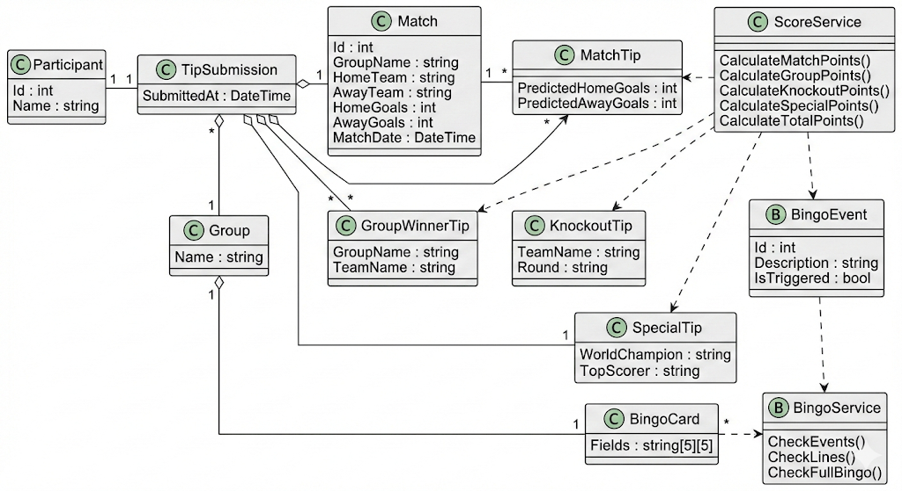

# Projektüberblick

Das Projekt beschreibt die Entwicklung eines automatisierten Tippspiel‑Systems zur Fußball‑Weltmeisterschaft 2026. Inhaltlich kombiniert es ein klassisches Ergebnis‑Tippspiel mit Sondertipps und einem ereignisbasierten Bingo‑System. Ziel ist es, ein fachlich realistisches System umzusetzen, das komplexe Regeln klar strukturiert abbildet und automatisiert auswertet.

# Fachliche Anforderungen und Spiellogik

Das Tippspiel umfasst mehrere Bestandteile: die Tippabgabe aller Gruppenspiele, die Vorhersage der Gruppensieger, Tipps zu den erreichten KO‑Runden sowie Sondertipps wie Weltmeister und Torschützenkönig. Ergänzend dazu wird ein Bingo‑System integriert, bei dem vordefinierte Turnierereignisse auf individuellen Bingo‑Karten der Teilnehmer abgebildet werden. Sobald ein Ereignis im Turnier eintritt, gilt das entsprechende Feld als erfüllt. Linien und vollständige Bingos werden automatisch erkannt und sowohl für Sondergewinne als auch für die Gesamtwertung berücksichtigt.

# Objektorientierte Struktur des Systems

Alle zentralen fachlichen Konzepte werden durch eigene Klassen repräsentiert. Dazu zählen unter anderem Teilnehmer, Tippabgaben, Spiele, Gruppen, KO‑Runden, Bingo‑Karten und Bingo‑Ereignisse. Unterschiedliche Tipparten werden getrennt modelliert, folgen jedoch einem einheitlichen Grundprinzip. Die Auswertung der Tipps und die Punkteberechnung erfolgen über dedizierte Service‑Klassen, die ausschließlich auf den Domänenobjekten arbeiten. Dadurch bleibt die Logik übersichtlich, erweiterbar und gut nachvollziehbar.

# Datenbasis und Verarbeitung

Die gesamte Datenverarbeitung basiert auf JSON‑Dateien. Alle Teilnehmer‑Tipps liegen in einem einheitlichen JSON‑Format vor und bilden die zentrale Schnittstelle des Systems. Die Erstellung dieser Dateien kann optional über eine lokale Weboberfläche erfolgen, die ausschließlich zur Dateneingabe dient und die Ergebnisse direkt im Projektverzeichnis speichert. Alternativ können die JSON‑Dateien auch manuell erstellt werden. Für Entwicklungs‑ und Testzwecke werden die Ausgaben einer Fußball‑API auf Basis der letzten Weltmeisterschaft verwendet, um reale Turnierdaten zu simulieren.

# Automatisierung und Erweiterbarkeit

Auf Grundlage der eingelesenen Spieldaten werden Punkte, Zwischenwertungen, Gesamtwertungen und Bingo‑Ereignisse automatisch berechnet. Die Logik ist dabei vollständig von technischen Details wie Dateizugriffen, API‑Anbindung oder Benachrichtigungen getrennt. Optional können wichtige Ereignisse, etwa Zwischenwertungen oder Bingo‑Erfolge, automatisiert über eine WhatsApp‑Schnittstelle kommuniziert werden. Durch den modularen Aufbau lässt sich das System problemlos erweitern, etwa für andere Turniere oder angepasste Regelwerke.

# UML-Klassendiagramm

