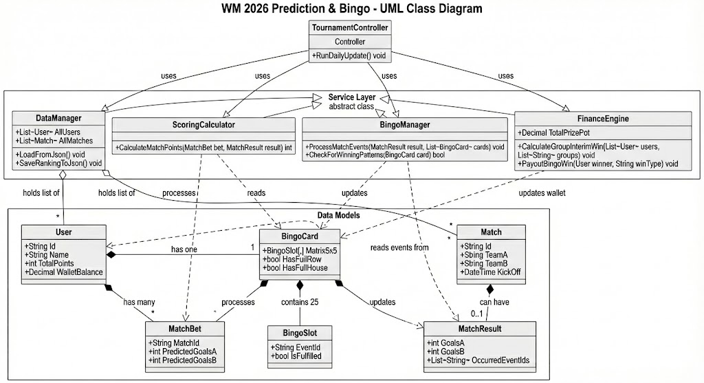

# Projekt-Exposé: WM 2026 Prediction Engine & Bingo Backend

## 1. Einleitung und Motivation
Die Fußball-Weltmeisterschaft 2026 ist ein globales Großereignis, das traditionell von Tippspielen begleitet wird. Dieses Projekt zielt darauf ab, die klassische Tipprunde durch eine innovative "Bingo-Komponente" und komplexe Zwischenwertungen zu erweitern.

**Neben der akademischen Zielsetzung ist geplant, dieses System tatsächlich produktiv für eine reale Tippgemeinschaft von ca. 200 Personen während der WM 2026 einzusetzen.**

Das Ziel dieses Softwareprojekts ist die Entwicklung eines robusten **Backends**, das die Verwaltung der Teilnehmer, deren Tipps sowie die automatisierte Auswertung von Spielereignissen übernimmt. Im Gegensatz zu Standard-Lösungen stehen hier komplexe, benutzerdefinierte Regeln (z. B. Bingo-Events, gruppierte Zwischengewinne) im Vordergrund, die eine maßgeschneiderte Logik erfordern.

## 2. Zielsetzung
Das Hauptziel ist die Implementierung einer **Auswertungs-Logik (Calculation Engine)**, die:
1.  Tipps und Bingo-Konfigurationen der Nutzer einliest.
2.  Spielergebnisse und Ereignisse verarbeitet.
3.  Ein detailliertes Ranking sowie Gewinnverteilungen basierend auf einem komplexen Regelwerk berechnet.

### 2.1 Abgrenzung und Fokus
Der Fokus der Entwicklung liegt auf der **Backend-Logik** und der **Datenverarbeitung**.
* **Primär:** Verarbeitung von JSON-basierten Daten (Input/Output) zur Sicherstellung der Testbarkeit, Portabilität und einfachen Abgabe des Projekts.
* **Sekundär (Ausbaustufe):** Entwicklung einer Web-Oberfläche und Anbindung an eine Azure SQL Datenbank (wird bei ausreichender Zeit umgesetzt).

---

## 3. Funktionale Anforderungen

Das System muss folgende Kernfunktionen abbilden:

### 3.1 Daten-Input (JSON-basiert)
Das System muss zwei Arten von Eingabedateien verarbeiten können:
* **User-Tipps:** Eine JSON-Struktur, die pro User alle 72 Gruppenspiele, Gruppensieger, KO-Runden-Picks, Sondertipps und das individuelle 5x5 Bingo-Feld enthält.
* **Match-Data (Simuliert):** Eine JSON-Datei, die den aktuellen Turnierstatus abbildet (Ergebnisse, Torschützen, Karten, etc.). Diese Datei simuliert die Antwort der *API-Football*, um eine konsistente Testumgebung für die Abgabe zu gewährleisten.

### 3.2 Die "Calculation Engine" (Kernlogik)
Die Engine berechnet täglich den Punktestand neu.

**A. Klassische Tipp-Auswertung:**
* Punktevergabe nach Ergebnis (3), Tordifferenz (2), Tendenz (1).
* Validierung der KO-Phasen-Tipps (Punkte pro Runde, Team darf nur 1x pro Runde werten).
* Sondertipps (Weltmeister, Torschützenkönig inkl. Tie-Breaker Regel "zuerst genannter Spieler").

**B. Bingo-Logik:**
* Überprüfung der 50 möglichen Ereignisse gegen die realen Match-Daten (z. B. "Rote Karte in Gruppe A").
* Status-Update der 5x5 Matrix jedes Spielers (Mitte = Free).
* Erkennung von Mustern: Einzelne Felder (3 Pkt), Linien (8 Pkt), Full House (20 Pkt).
* Tracking der zeitlichen Abfolge für Geldgewinne (z. B. "Wer hat die *erste* Linie?").

**C. Finanz-Logik & Zwischenwertungen:**
* Berechnung der 6 Gruppen-Cluster (z. B. A+B) für die 300 € Zwischengewinne.
* Verteilung der Bingo-Geldpreise (First Line, etc.) oder Fallback-Verteilung (Top 5 Plätze), falls kein Bingo erreicht wird.
* Endabrechnung des 1.100 € Haupttopfes (Platz 1–10).

### 3.3 Output
Das System generiert eine `ranking.json` (oder strukturierte Konsolenausgabe), die das aktuelle Leaderboard, die Finanzstände und den Bingo-Fortschritt anzeigt.

---

## 4. Technische Architektur und Klassendesign

Die Architektur ist bewusst schlank gehalten, trennt aber sauber zwischen **Daten** (Models), **Logik** (Services) und **Speicherung** (Data Access). Dies gewährleistet Übersichtlichkeit und Testbarkeit.

### 4.1 Datenmodelle (Models)
Diese Klassen repräsentieren die Objekte des Spiels. Sie enthalten keine komplexe Logik, sondern nur Daten.

* **`User`**: Repräsentiert einen Teilnehmer mit Name, ID, seinem aktuellen Punktestand und dem gewonnenen Preisgeld.
* **`Match`**: Ein reales Spiel im Turnierplan. Enthält Daten wie `MatchID`, `TeamA`, `TeamB`, `KickoffTime` und nach Spielende das `MatchResult` (Tore, Karten, Statistiken).
* **`Bet`**: Der Tipp eines Users für ein spezifisches Spiel (getipptes Ergebnis) oder eine Turnierphase (getippter Sieger).
* **`BingoCard`**: Repräsentiert das 5x5-Feld eines Users. Sie speichert, welche der 25 Felder bereits "aktiviert" (erfüllt) wurden.
* **`BingoEvent`**: Definition eines Ereignisses (z. B. "Rote Karte"). Dient als Referenzkatalog.

### 4.2 Logik-Kern (Services)
Hier findet die eigentliche Berechnung statt. Die Logik wird in überschaubare Manager aufgeteilt.

* **`DataManager`**: 
    * Zuständig für Input/Output.
    * Lädt `users.json` (Tipps) und `matches.json` (Ergebnisse) beim Start.
    * Speichert das Ranking am Ende wieder ab.
* **`ScoringCalculator`**: 
    * Die "Mathe-Klasse". Sie bekommt einen `Bet` und ein `Match` und gibt die Punkte zurück (0, 1, 2 oder 3).
    * Berechnet auch Punkte für KO-Runden und Sondertipps.
* **`BingoManager`**: 
    * Prüft, ob Ereignisse im Turnier eingetreten sind.
    * Aktualisiert die `BingoCard` der User.
    * Erkennt Gewinnmuster (Reihen, Full House).
* **`FinanceEngine`**: 
    * Verwaltet die Töpfe (1.800 € Gesamt).
    * Berechnet die Zwischengewinne für Gruppen-Cluster und verteilt Bingo-Prämien.

### 4.3 Programmablauf (Der "Controller")
Eine zentrale Klasse, der **`TournamentController`**, steuert den Ablauf ähnlich einem Dirigenten:

1.  **Init:** Der `DataManager` lädt alle Daten in den Speicher.
2.  **Update:** Der Controller iteriert über alle beendeten Spiele.
3.  **Calculation:**
    * Der `ScoringCalculator` aktualisiert die Punkte aller User.
    * Der `BingoManager` prüft Ereignisse und aktualisiert Bingo-Status.
4.  **Ranking:** Die User-Liste wird nach Punkten sortiert.
5.  **Payout:** Die `FinanceEngine` prüft, ob Auszahlungen fällig sind (z.B. Gruppe A+B beendet).
6.  **Save:** Der neue Status wird exportiert.

### 4.4 UML-Klassendiagramm

---

## 5. Projektablauf & Meilensteine

### Phase 1: Datenmodellierung & MVP (Pflichtteil)
* Definition der JSON-Schemata für Tipps und Match-Daten.
* Implementierung der Punkte-Logik (Gruppenphase & KO-System).
* Implementierung der Bingo-Matrix-Auswertung.
* **Ziel:** Erfolgreicher Run eines Test-Cases via Konsole mit JSON-Input.

### Phase 2: Erweiterte Logik (Pflichtteil)
* Implementierung der Geld-Gewinnverteilung (Zwischengewinne & Haupttopf).
* Handling von Sonderfällen (z. B. Torschützenkönig-Gleichstand).
* Simulation eines kompletten Turnierverlaufs durch Einspeisen verschiedener Tages-Dateien.

### Phase 3: Cloud & UI (Kür/Optional)
* Bereitstellung einer einfachen Web-Oberfläche zur Visualisierung der JSON-Daten.
* Deployment auf Azure Students.
* Anbindung der echten API-Football Schnittstelle für Live-Daten.

---

## 6. Teststrategie für die Abgabe
Um die Korrektheit der komplexen Regeln zu beweisen, werden **Szenario-Dateien** erstellt:
1.  `input_bets.json`: Enthält Test-User mit unterschiedlichen Tipp-Strategien.
2.  `match_day_X.json`: Simuliert verschiedene Turnier-Tage (z. B. "Ende Gruppenphase", "Finale").
3.  **Erwartetes Ergebnis:** Das System muss für diese Inputs deterministisch die korrekten Punkte und Geldbeträge ausgeben (Vergleich Soll/Ist).